  <h1>🏰 King Bug Castle (KGC)</h1>
  
<strong>A fully-featured Private Server & Reverse Engineering Toolkit for "King God Castle" (v170.1.00+)</strong>

  
  
  
  

 

> **⚠️ DISCLAIMER:** This is a fan-made, non-profit project created **strictly for educational, interoperability, and research purposes**. It is not affiliated with, endorsed by, or associated with Awesomepiece. The server-authoritative game logic is fully emulated locally. The client is only patched to bypass certificate pinning and local anti-cheat (XIGNCODE3) checks to allow for offline development and local traffic interception.

---

## 📖 Overview

**King Bug Castle** is an ambitious reverse-engineering project that reconstructs the entire backend API for the mobile game *King God Castle* (`com.awesomepiece.castle`). 

By dumping the IL2CPP metadata and intercepting network traffic, we have successfully mapped over **280+ REST API endpoints**, 400+ wire models, and recreated a local FastAPI server that fully emulates the `axis-game` infrastructure. This allows for complete offline gameplay, data manipulation (Gold, Gems, Levels), custom artifact testing, and deep-dive mechanics research without ever touching the live production servers.

## ✨ Core Features

* 🚀 **Full API Emulation**: A robust Python/FastAPI server replicating the exact behavior of `axis-game.awesomepiece.com` and `kgc-k8s-1.awesomepiece.com`.
* 🛡️ **Client Binary Patching (ARM64)**: Automated Python pipeline (`rebuild_arm64.py`) that patches `libil2cpp.so` to defeat SSL/TLS pinning and `CertificateHandler` checks.
* 👻 **XIGNCODE3 Bypass**: Emulates the Wellbia anti-cheat seed exchange (`/auth/xcdSeed`) to allow the client to boot without verification crashes.
* 🛠️ **`kgc-cli` Toolkit**: A proprietary command-line utility used for lightning-fast asset extraction, S3 CDN mirroring, and XML data diffing.
* 🗃️ **Hot-Reloading State**: Complete control over your account. Edit `state/player.json` or `data/*.json` to instantly manipulate currencies, decks, artifacts, and progression.

---

## 🛠️ Environment & Prerequisites

To successfully run the backend and deployment scripts, your system must meet the following environment requirements:

* **OS**: Linux (Ubuntu/Debian recommended) or macOS. (Windows requires WSL2).
* **Python**: Python 3.11 or higher. (A `.venv` virtual environment is highly recommended).
* **System Tools**:
  * `apktool` (for unpacking/repacking APKs)
  * `apksigner` (for signing the patched APK)
  * `adb` (Android Debug Bridge, for installing onto device/emulator)
* **Emulator**: If testing locally, **redroid** Docker container is highly recommended and must be run with `androidboot.redroid_gpu_mode=guest` (swiftshader) to avoid vsync/choreographer crashes.
* **Dependencies**: Run `pip install -r server/requirements.txt` to install FastAPI, Uvicorn, LIEF, and other dependencies.

---

## 🗺️ Architecture & Workflow

The private server emulator is designed to intercept and process all traffic from the game client by fully replicating the backend architecture of King God Castle.

### System Components

1. **FastAPI Backend Emulator (`server.py`)**: Acts as the central game server (`axis-game.awesomepiece.com`). It serves over 280+ dynamically mapped REST endpoints. Instead of relying on a traditional database, all state and logic are driven by flat JSON files located in `server/data/` (for static rules) and `server/state/player.json` (for live player progression).
2. **Binary Patcher (`rebuild_arm64.py`)**: Before the game can connect to the emulator, the client's `libil2cpp.so` must be modified. This automated pipeline injects assembly to bypass SSL pinning (forcing `CertificateHandler.ValidateCertificate` to always return true) and skips NRE (NullReferenceException) triggers in the UI.
3. **Local XML CDN**: The game downloads "Patch Assets" (XML tables) at boot. We mirror the official S3 CDN locally. The backend directs the game to our local CDN (`kgc-cdn-1.awesomepiece.com`), allowing us to inject custom items, text modifications, and rule changes via `rebuild_xml_bundle.py`.
4. **XIGNCODE3 Stub**: The proprietary anti-cheat module prevents the game from booting if it can't reach the Wellbia servers. We replace the heavy `libxigncode.so` with a lightweight 8KB C-stub that successfully fakes the `/auth/xcdSeed` handshake, entirely bypassing the local integrity checks.

```mermaid
graph TD
    Client[📱 Android Client / Emulator]
    FastAPI[⚡ Local FastAPI Server]
    CDN[📦 Local XML CDN]
    XIGNCODE[🛡️ 8KB Xigncode Stub]
    Data[(JSON Data & State)]

    Client -- "HTTPS (Bypassed TLS via ARM64 Patch)" --> FastAPI
    Client -- "Fetch XML Patch Bundles" --> CDN
    FastAPI <--> Data
    Client <-->|"Faked Seed Handshake"| XIGNCODE
    
    style Client fill:#2D3748,stroke:#4A5568
    style FastAPI fill:#009688,stroke:#00796B
    style Data fill:#D69E2E,stroke:#B7791F
    style CDN fill:#3182CE,stroke:#2B6CB0
```

---

## 🧭 Documentation Hub

We have heavily documented the entire teardown and rebuild process. Depending on what you want to do, pick your path:

### 👨‍💻 For Backend Developers & Contributors
Want to spin up the local server, patch your own APK, and start modifying API responses?
👉 **Read the [Server Setup Guide & Workflow](server/README.md)**

### 🎮 For End-Users / Players
Did you just download the `.zip` release and want to know how to install it on your device/emulator?
👉 **Read the [Player Installation Guide](README_PLAYER.md)**

### 🧠 For Reverse Engineers
Want to understand how we dumped IL2CPP, mapped the 280+ routes, defeated SSL pinning, and how the S3 CDN delivers XML patches?
👉 **Read the [Knowledge Base & Teardown Notes](KNOWLEDGE.md)**

---

## 📂 Repository Layout

| Directory | Purpose |
| --- | --- |
| 📁 `server/` | The core FastAPI backend and automated ARM64 patching scripts (`rebuild_arm64.py`, `deploy.sh`). |
| 📁 `server/data/` | Static JSON models and response templates (Docs: [`server/data/README.md`](server/data/README.md)). |
| 📁 `api/` | Auxiliary integrations and external tool endpoints. |
| 📁 `scripts/` | Shell and Python automation scripts for fetching CDN data and extracting assets. |
| 📁 `xml_history/` | Historical staging area for live CDN XML bundles by patch date. |
| 📁 `il2cpp/` & `ghidra/` | Dumped metadata (`dump.cs`), string literals, and Ghidra project files. |
| 📁 `unity/` | Unity project files specifically created to repack `AssetBundles`. |
| ⚙️ `kgc-cli` | The core executable binary tool for data operations. |

---

## 🤝 Contributing

This project relies on continuous mapping as the game updates. If you find an unmapped route returning a `500` or an empty object, capture the real traffic using `mitmproxy`, find the matching model in `server/generated/models.json`, and add the override in `server.py` or `server/data/static_overrides.json`.

---

## 💖 Support & Donate

If you found this project helpful for your research, reverse-engineering learning, or just had fun messing around with the private server, consider supporting the development! Maintaining this project requires constant teardowns of new game updates.

*(Don't forget to update these placeholder links to your actual donation links!)*
